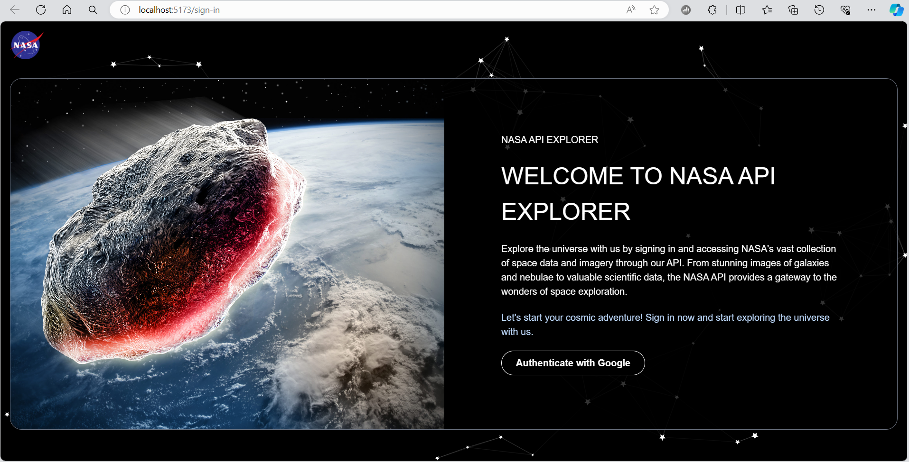
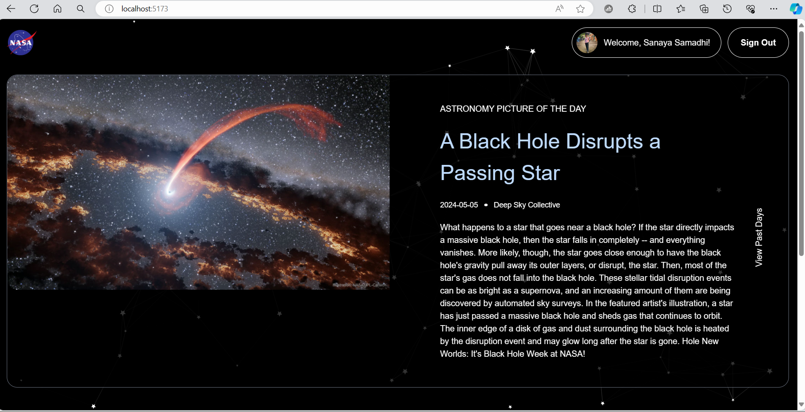
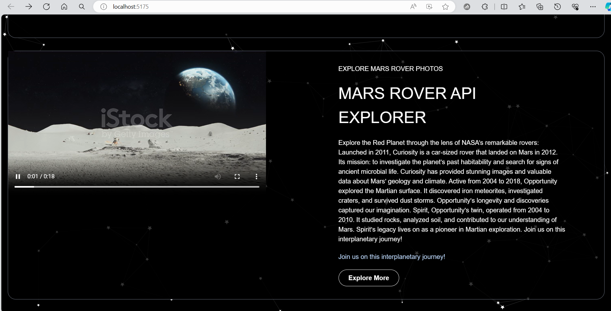
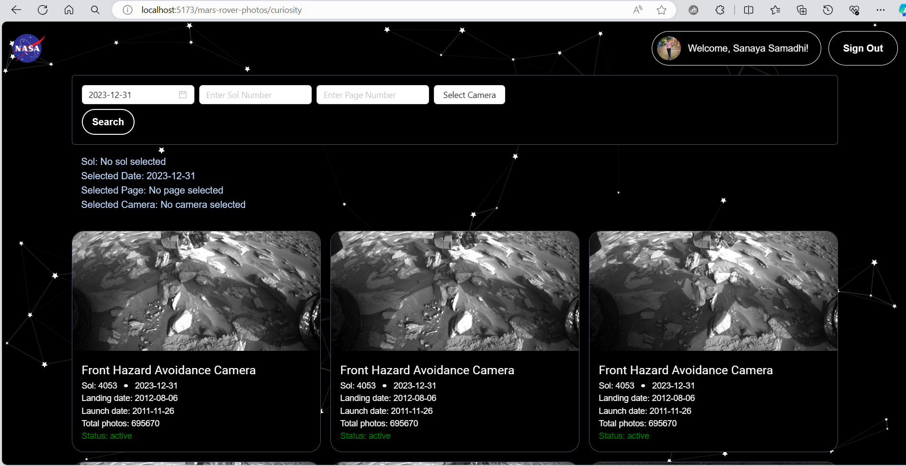
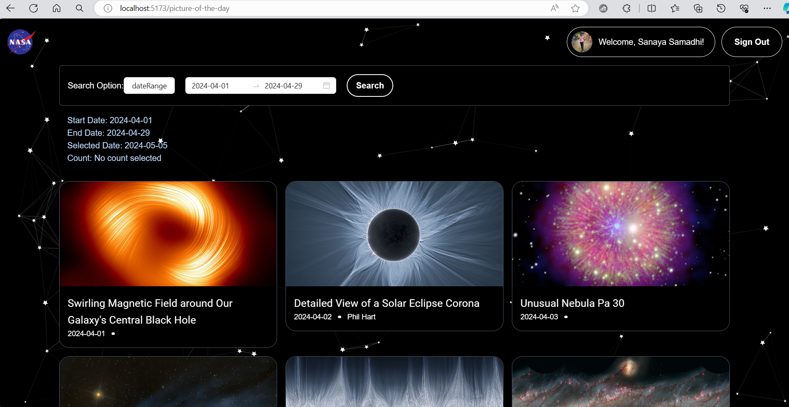
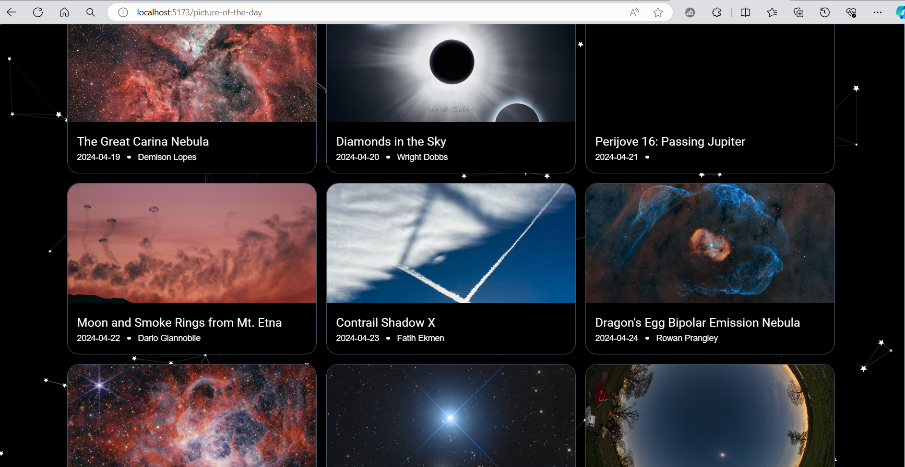
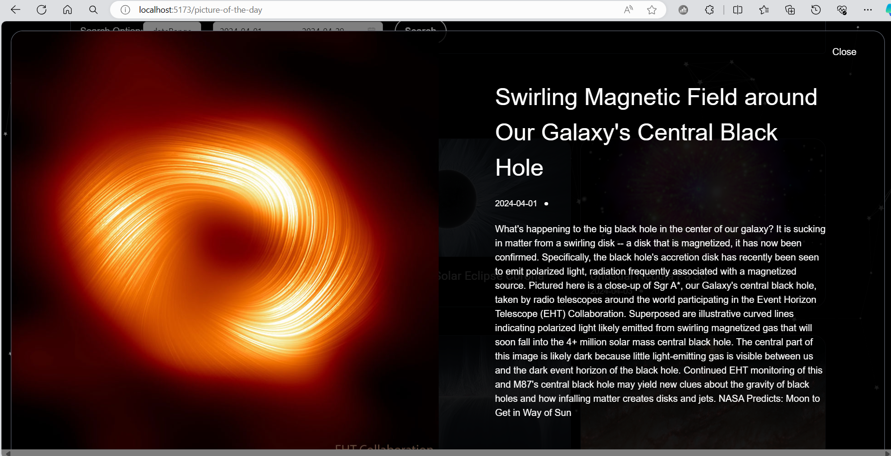
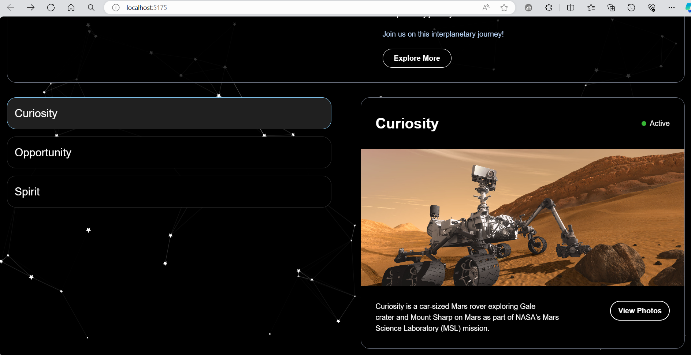

# React + Vite

This template provides a minimal setup to get React working in Vite with HMR and some ESLint rules.

Currently, two official plugins are available:

- [@vitejs/plugin-react](https://github.com/vitejs/vite-plugin-react/blob/main/packages/plugin-react/README.md) uses [Babel](https://babeljs.io/) for Fast Refresh
- [@vitejs/plugin-react-swc](https://github.com/vitejs/vite-plugin-react-swc) uses [SWC](https://swc.rs/) for Fast Refresh


Step 1: Install Node.js and npm
Ensure you have Node.js and npm installed on your machine. You can download and install them from the official Node.js website.

Step 2: Install Dependencies
Use npm to install the project dependencies. Navigate to the root directory of your project and run:

```
npm install
```

Step 3: Run the Development Server
After installing the dependencies, you can run the development server using the following command:

```
npm run dev
```

React Component Testing with Jest and React Testing Library
This project utilizes Jest and React Testing Library for testing React components. Below are the instructions on how to run the test cases.

Installation
Make sure you have Node.js and npm installed on your machine.

```
npm install
```

Running Tests
Run All Tests
To run all the test cases, use the following command:

```
npm run test:all
```

This command will execute all the test suites available in the project.

Run Specific Test
To run a specific test file, provide the path to the test file after the npm run test:specific command.

For example, to run the SignIn.test.js test file located in the src/test directory:

```
npm run test:specific src/test/SignIn.test.js
```

Run Tests with Coverage
You can also generate a test coverage report by running:

```
npm test -- --coverage
```

## Deployment

This project is deployed using Vercel. You can visit the deployed site at [https://af-nasa-deploy-test.vercel.app/](https://af-nasa-deploy-test.vercel.app/).


## Documentation

In git repository have word file called NASA_API_REPORT_AF_ASSIGNMENT2_IT21302862.docx
After clone the project open the document in your local machine.


##Screenshots of the web application










